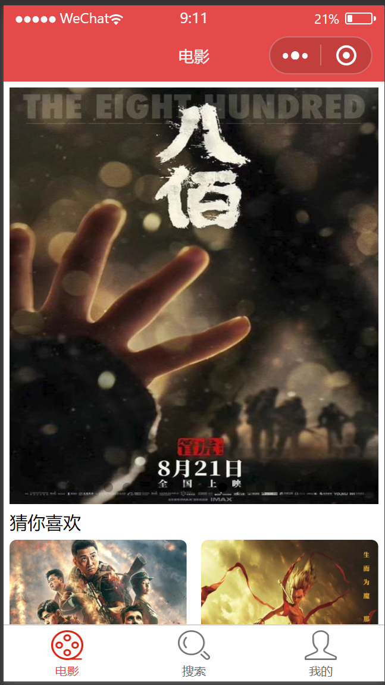
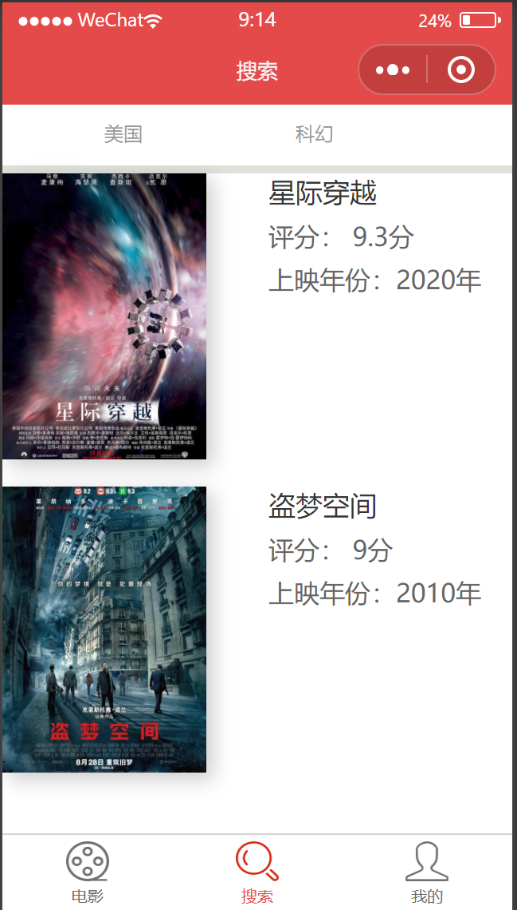
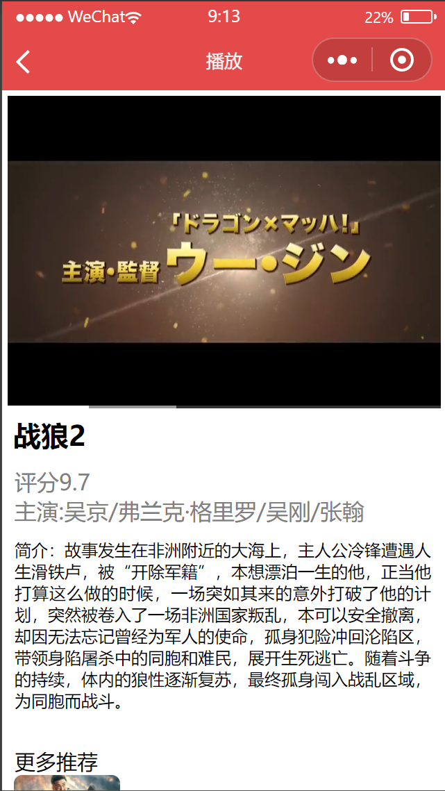
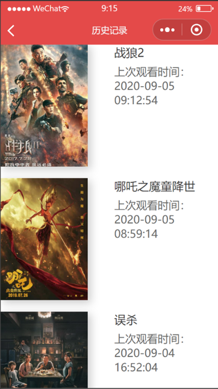
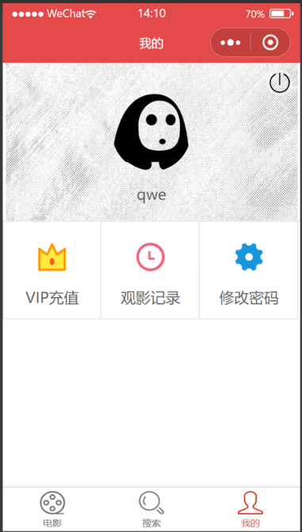

# Online Cinema: An online Wechat mini program

# Introduction

WeChat mini-programs are "sub-applications" within the Tencent WeChat ecosystem. Different from iOS and Android apps that need to be downloaded and installed, such mini-programs are light. They can provide native apps' user experience and are more manageable. Mini programs can use powerful WeChat APIs to implement online payments, position, face recognition, and so on. Using WeChat mini program development tools and WeChat APIs, applications can be achieved and deployed efficiently. 

Online Cinema is a collaborative WeChat mini program supporting movie searching, watching, user status and permission, recommending, and recording history. 
* The app's front-end is utilized using jQuery, AJAX, and Wechat APIs. 
* The backend server is implemented with SpringBoot, MyBatis and MySQL. 
* Achieved user login, status recording and permission control using cookie and session techniques. 

# Techniques

HTML, Javascript, jQuery, AJAX, Wechat front-end framwork, SpringBoot and MyBatis. 

# Samples Showcase

**Home Page**

Homepage will show movies in video page. 

**Search Page**

User can search movies according to areas and types. 

**Play Page**

User can watch movie in this page, there is also additional information like movie name, ratings and short descriptions.

**History Page**

User can review the watching history. 

**User Status Page**

This page is developed for users to upgrade memberships, sign in and out, change passwords and so on. 

